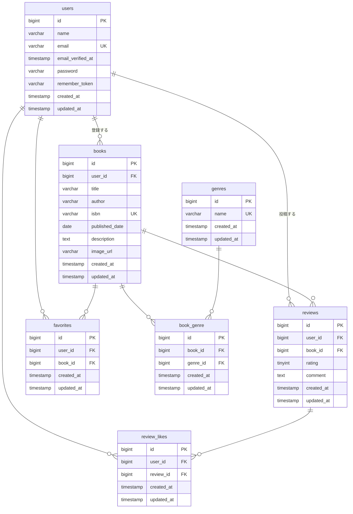

# BookShelf 書籍レビューアプリ

## ER図

```mermaid
erDiagram
    users ||--o{ books : "登録する"
    users ||--o{ reviews : "投稿する"
    users ||--o{ favorites : ""
    users ||--o{ review_likes : ""
    books ||--o{ book_genre : ""
    genres ||--o{ book_genre : ""
    books ||--o{ reviews : ""
    books ||--o{ favorites : ""
    reviews ||--o{ review_likes : ""

    users {
        bigint id PK
        varchar name
        varchar email UK
        timestamp email_verified_at
        varchar password
        varchar remember_token
        timestamp created_at
        timestamp updated_at
    }
    books {
        bigint id PK
        bigint user_id FK
        varchar title
        varchar author
        varchar isbn UK
        date published_date
        text description
        varchar image_url
        timestamp created_at
        timestamp updated_at
    }
    genres {
        bigint id PK
        varchar name UK
        timestamp created_at
        timestamp updated_at
    }
    book_genre {
        bigint id PK
        bigint book_id FK
        bigint genre_id FK
        timestamp created_at
        timestamp updated_at
    }
    reviews {
        bigint id PK
        bigint user_id FK
        bigint book_id FK
        tinyint rating
        text comment
        timestamp created_at
        timestamp updated_at
    }
    favorites {
        bigint id PK
        bigint user_id FK
        bigint book_id FK
        timestamp created_at
        timestamp updated_at
    }
    review_likes {
        bigint id PK
        bigint user_id FK
        bigint review_id FK
        timestamp created_at
        timestamp updated_at
    }
```
